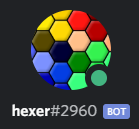

# hexer
  
[Add the bot](https://discord.com/api/oauth2/authorize?client_id=774389928422539266&permissions=268435456&scope=bot)  
[Support](https?//discord.com/users/106068236000329728)

--- 

## What is this?
With this bot in a server, everyone gets their own role which they can customise the name and colour of.  
Since the role limit for discord servers is 250, you should only use this bot in small servers.  
[Colour picker](https://www.google.com/search?q=color+picker)

---

## Commands
`!help` : show these commands  
`!editrole [hex code] [role name]` : edit your hexer role (e.g. `!editrole #6be6ff light blue`)  
`!setprefix [new prefix]` : sets the bot's prefix for this server (only users with the "Manage Server" permission may use this)  
`!forceresetrole` : forces a reset of your hexer role if the bot just doesnt seem to be working  